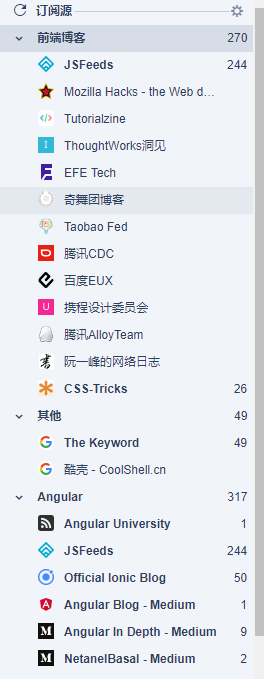

# 月报如何提交？

[月报](https://github.com/1ziton/month) 是受 `JavaScript高级前端开发群` [jsfront/month](https://github.com/jsfront/month) 启发的，本内容也是Fork其对应文件做修改调整。因为前端技术本身的变化百花齐放，所以内容的类别和形式也趋向于多样化，收集和分享做为技术沉淀。也可以作为一个记录回溯，日后可以方便查找资源。

- 新的世界也有新的挑战，由于现在群很多，高质量的链接或交流的内容不断的出现，需要一定的力量来沉淀，所以我们专业的编辑团队也应运而生。
- 同时另外一个原因是：前端的变化真的太快了，但我们为什么一个月一发，目的还是想让这个快速的节奏能够慢下来，能够在业余有那么一段时间去集中的消化这个快速变化的信息沉淀。
- 目前虽然各个信息出口比较多，但是内容质量还是不太高，信息噪音太多。我们试图通过一个团队通过一定的专业眼光的识别，推荐质量比较好的文章出来。虽然我们群也有不少同学刚入行，但有这个起点，比一般平台网站的编辑已经高一个档次，在我们其它群的熏陶下，眼界也是不一样的。

#### 一. 如何提交
首先使用 `Git` 工具提交到[https://github.com/1ziton/month](https://github.com/1ziton/month)，然后月底的时候发布到为gh-page。

##### 1.1 如何发起 `pull request`

推荐 `GitHub` 使用工具，建议 [[WebStorm][webstorm-download]]() , [[Sourcetree][sourcetree-download]]() ，命令行( window 加强 `CMD` 工具 [[Cmder][cmder-home]]() ，建议不要下载那个客户端。

- [GitHub 如何创建 pull 请求](https://github.com/waylau/github-help/blob/master/Creating%20a%20pull%20request%20%E5%88%9B%E5%BB%BA%20pull%20%E8%AF%B7%E6%B1%82.md)
- [GitHub 的 pull request 是指什么意思？](https://www.zhihu.com/question/21682976)
- [利用 WebStorm 来管理你的 GitHub](http://www.mrfangge.com/how-to-use-webstorm-to-manage-your-github/)
- [使用 WebStorm 上传代码到 GitHub](http://www.jianshu.com/p/752613f4b1c9)
- [Git本地项目上传 & SourceTree & GitHub 简单使用](http://www.blogs8.cn/posts/Au2te07)
- [GUI for Git|SourceTree|入门基础](http://www.jianshu.com/p/be9f0484af9d)
- [SourceTree 使用](http://blog.sina.com.cn/s/blog_a3c770670102uywk.html)
- [Git工作流的最佳实践总结](https://www.jianshu.com/p/202de00f267f)


##### 1.2 如何提交：

整个流程（其中我为`giscafer`）：
我先 `fork` 了 `1ziton/month` 的仓库，然后我从我的仓库克隆到本地修改，修改完后提交到我的仓库，然后我再申请 `pull request` ，`1ziton/month` 同意合并后其实整个过程就完了，但是 `1ziton/month` 经常会有更改就需要我刚那一步在我本地同步一下你的远程仓库，同步后再提交到我的仓库。
具体代码:
```bash
# 列出远程仓库 URL
$ git remote -v
# List the current remotes （列出当前远程仓库）
# origin  https://github.com/user/month.git (fetch)
# origin  https://github.com/user/month.git (push)

# 设置一个新的远程仓库
$ git remote add 1ziton git@github.com:1ziton/month.git

# 再次列出远程仓库 URL
$ git remote -v
# 1ziton     git@github.com:1ziton/month.git (fetch)
# 1ziton     git@github.com:1ziton/month.git (push)
# origin      git@github.com:giscafer/month.git (fetch)
# origin      git@github.com:giscafer/month.git (push)

# 获取上游代码
$ git fetch 1ziton

# 检查你的 fork’s 本地 master 分支，如果不在 master 分支就切换到该分支
$ git checkout master
# Switched to branch 'master'

# 合并来自 1ziton/master 的更改到本地 master 分支上。
$ git merge 1ziton/master
```

##### 1.3 提交之后：

提交合并到 `1ziton/month` 之后，为了保证与主仓库代码的一致性，还需要进行一次本地与远程仓库的手动更新。

- [如何同步 Github fork 出来的分支](http://jinlong.github.io/2015/10/12/syncing-a-fork/)
- [GitHub 同步 fork 别人的项目到自己的仓库](https://segmentfault.com/a/1190000003703918)


#### 二. 提交的注意点

- 内容必须超过当前显示器一屏。
- 文章最好是近期当月发表文章，如果经典文章，可以适当放宽限制。
- 确定文章质量方法：快速的阅读头、中、尾三部分，如果论点明确，论据充分可直接推送。比如：

    - 也有的是平铺式的，结构简单，目录清晰，看起来一目了然。[【我的产品观】开发wangEditor一年总结](http://www.cnblogs.com/wangfupeng1988/p/4931999.html)
    - 也有的是以反问的形式做为标题，然后以背景开发，以论据为主题：[【如何做好一名实习生】](http://www.cnblogs.com/hustskyking/p/how-to-be-an-excellent-intern.html)
    - 有的纯技术文章或者没有注重任何的形式，就是以一系列的问题集合做为主体。这种内容只要超过一屏也是可以的，比如：[【你应该知道的JavaScript】](http://youbookee.com/2016/08/30/js-you-should-know/)
- 文案排版最好能遵循[[文案排版规范][coding-copy-writing]]()（此规范来自 CODING 最佳实践）。
- 提交时务必注意，有一个清晰的 `commit` 信息（注明提交的内容，修改了什么或者更新了什么），方便代码的整体维护。详见[Git提交的正确姿势：Commit message 和 Change log 编写指南](https://mp.weixin.qq.com/s?__biz=MzA4MjU5NTY0NA==&mid=401840568&idx=1&sn=051879b73f32ab7bcbcfc2e3cdd85f07&scene=1&srcid=0107l8avY4frKW3kfhaIUoNY&key=41ecb04b0511100344d280ce4225cc8c4d97599af475ef134186f7df3a7b8ace7e0e2eebc59d96ca00d6c9abf1ebf9e2&ascene=0&uin=MjAyNzY1NTU%3D&devicetype=iMac+MacBookPro12%2C1+OSX+OSX+10.11.2+build(15C50)&version=11020201&pass_ticket=ymbjwf7oU6CeUuxBIkhi0U6TOA5EP5ZWHXbpm6NVy%2FY%3D)
```bash
# 正确的做法
$ git commit -m "update:添加了月报的 url "
# 错误的做法
$ git commit -m "update"
```

#### 三. 内容采集的方式
就是日常月报上的链接从哪里收集，从那里能够得到最新的信息，由于英文的传播问题，这里边暂时只列举中文的，英文的回头的补上，同学有好的英文网站也可以加上。或者是大家在RSS订阅的文章，平时阅读到好的就分享出来，比如下边我订阅的网站：



##### 3.1 来自于各个前端集合网站中的博客或技术站点

- [【前端收集】](https://github.com/jikeytang/front-end-collect)：主要是一个当下流行的前端相关博客收集
- [【稀土掘金】](http://gold.xitu.io/#/)：综合性的资讯网站，但是前端文章质量良莠不齐
- [【博客园】](http://www.cnblogs.com/)：综合性的博客网站，前端文章同样质量有好有坏
- [【开发者头条】](https://toutiao.io/)：综合性的资讯网站，但是旧文章比较多
- [【前端乱炖】](http://www.html-js.com/)：专业前端类网站，相对来说更新较慢
- [【sf.gg】](https://segmentfault.com/)：综合性的社区网站，质量有高有低
- [【div.io】](http://div.io/)：专业前端社区，更新较慢
- [【众成翻译】](http://www.zcfy.cc/)：中国最好的技术翻译社区，最懂译者的翻译平台，奇虎360最大前端团队“奇舞团”出品。

##### 3.2 信息集合网站

- [【大前端导航】](http://www.daqianduan.com/nav)
- [【WHYCSS】](http://whycss.com/)
- [【前端圈导航网站】](http://sentsin.com/daohang/)
- [【123.jser】](http://123.jser.us/)
- [【醉牛前端 - 最专业  最懂你】](http://f2er.club/)
- [【前端工具箱】](https://www.awesomes.cn/)
- [【前端导航网站】](http://fenav.com/#/index)
- [【前端导航网】](http://jsdig.com/)

#### App相关的开发人员补充

#### 四. 如何去重追溯

- `Fork` 到本地之后可以按项目全文手工查找。


[webstorm-download]:https://www.jetbrains.com/webstorm/
[sourcetree-download]:https://www.sourcetreeapp.com/
[cmder-home]:http://cmder.net/
[coding-copy-writing]:https://open.coding.net/copywriting.html